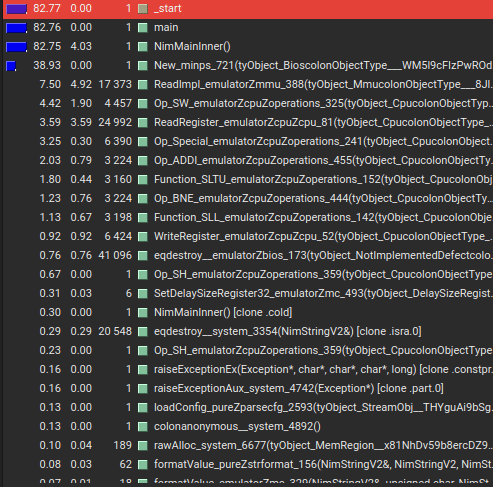

# nim_callgrind

A small utility to demangle Nim symbols from callgrind files.

## Usage

Run your (Nim) program with something like this:

    valgrind --tool=callgrind bin/minps_callgrind

Then generate a demangled output file with:

    python nim_callgrind.py INPUT_FILE OUTPUT_FILE

## Features

- Tries to detect Nim procedures, ignores everything else.
- Detects passed-by-value and passed-by-reference types.
- Extracts proper function names.
- Extracts module names (added between [] afterwards).

## TODO:

- [ ] Port the utility Nim once stabilized :)
- [ ] Add support for missing Nim types.
- [ ] Figure out better demangling, if possible.
- [ ] Test with more callgrind files.

## Example

